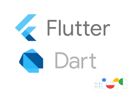

### Carlos Sulzer Pêgo
* Msc. Pesquisa Operacional e Inteligência Computacional
* sulzerpego@gmail.com

## FLUTTER E DART

* Flutter - v1.12.13:
* Dart - v2.7.2:
* Estrutura do Projeto
* Packages - [Pacotes Adicionais](https://pub.dev/packages)
* Hot Reload
* Textos
* StatelessWidget
* StatefullWidget
    - State
* Widgets
* FutureBuilder

### Links
* [Flutter](https://flutter.dev) 

* [Flutter Docs](https://flutter.dev/docs)

* [Dart](https://dart.dev)

* [Curso - Udemy (Pago)](https://www.udemy.com/curso-completo-flutter-app-android-ios)

* [Curso de Flutter - André Baltieri (Grátis)](https://balta.io/cursos/7184)

* [Comunidade Fluterando](https://forum.flutterando.com.br)
